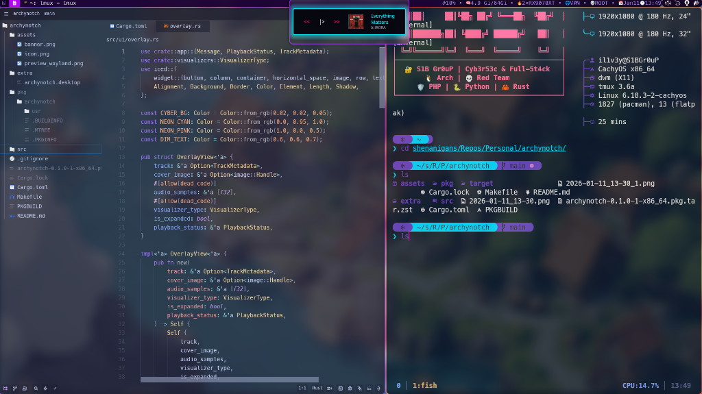

# 🎸 ArchyNotch


> **The Ultimate Cyberpunk Music Overlay for Linux**


**ArchyNotch** isn't just a music player—it's a statement. Inspired by the neon-soaked aesthetics of cyberpunk culture, this interactive "notch" sits elegantly on your desktop, providing seamless control over your media without breaking your flow.

Built with **Rust** 🦀 and **Iced** 🧊, it's blazing fast, lightweight, and looks absolutely stunning.

## 📑 Table of Contents

- [Preview](#-preview)
- [Features](#-features)
- [Prerequisites](#-prerequisites)
- [Installation](#-getting-started)
- [Controls](#-controls)
- [Configuration](#-configuration)
- [Project Structure](#-project-structure)
- [Troubleshooting](#-troubleshooting)
- [Roadmap](#-roadmap)
- [Contributing](#-contributing)

---

## 📸 Preview

### Wayland / KDE Plasma


### Tiling Window Managers (DWM, i3, Hyprland)



> **Note for Tiling WM Users:** The visual appearance (transparency, shadows, blur, and rounded corners) heavily depends on your compositor configuration (e.g., `picom.conf`). The screenshot above shows ArchyNotch running on **DWM** with a custom **picom** configuration. You may need to adjust your compositor rules to achieve a similar look (e.g., excluding ArchyNotch from tiling, enabling blur, etc.).

---

## ✨ Features

- **🔮 Cyberpunk Aesthetics**: Glassmorphism, neon glows, and smooth animations that breathe life into your desktop.
- **🎵 Universal Control**: Seamlessly integrates with **Spotify**, **VLC**, **Firefox**, and any other MPRIS-compatible player.
- **🖱️ Interactive Notch**:
  - **Collapsed**: A sleek, unobtrusive pill showing album art.
  - **Expanded**: Full playback controls and track details at your fingertips.
- **🖐️ Drag & Drop**: Place it anywhere! Click and drag the body to position it perfectly on your screen.
- **🚀 High Performance**: Native code, minimal resource usage.

---

---

## 🛠️ Prerequisites

Before building, ensure you have the necessary system dependencies installed.

**Arch Linux:**

```bash
sudo pacman -S alsa-lib openssl pkg-config freetype2 expat
```

**Debian / Ubuntu:**

```bash
sudo apt install libasound2-dev libssl-dev pkg-config libfreetype6-dev libexpat1-dev
```

## 🚀 Getting Started

### 📦 Installation

#### Option 1: Arch Linux (Recommended)

Use the provided `PKGBUILD` for a clean system install:

```bash
git clone https://github.com/ind4skylivey/archynotch.git
cd archynotch
makepkg -si
```

#### Option 2: Manual Install (Universal)

If you have Rust installed, you can build and install manually:

```bash
git clone https://github.com/ind4skylivey/archynotch.git
cd archynotch
cargo build --release
sudo make install
```

---

## 🎮 Controls

| Action                | Interaction                                   |
| :-------------------- | :-------------------------------------------- |
| **Expand / Collapse** | Click the **Album Art / Icon**                |
| **Move Window**       | Click and drag the **Main Body**              |
| **Play / Pause**      | Click the **Play** button (Expanded)          |
| **Next / Prev**       | Click the **<<** or **>>** buttons (Expanded) |

---

## ⚙️ Configuration

On first run, a configuration file is created at `~/.config/archynotch/config.toml`. You can tweak the starting position and size:

```toml
[window]
width = 320   # Default collapsed width
height = 90   # Default collapsed height
x = 800       # Horizontal position (adjust for your monitor)
y = 0         # Vertical position (0 = top of screen)
```

---

## 📂 Project Structure

```
archynotch/
├── assets/         # Images and icons
├── extra/          # Desktop entries and packaging files
├── src/
│   ├── audio/      # Audio capture and processing
│   ├── mpris/      # Media player integration (DBus)
│   ├── ui/         # Iced UI components and styling
│   ├── visualizers/# FFT and visualization logic
│   ├── app.rs      # Main application state and logic
│   └── main.rs     # Entry point
└── Cargo.toml      # Dependencies
```

---

## 🔧 Troubleshooting

### "I see a black box around the notch!" (DWM / X11 Users)

If you are using a window manager like **DWM**, **i3**, or **bspwm** that doesn't support transparency by default, you might see a black background.

**Solution:** Install and run a compositor like `picom`.

```bash
sudo pacman -S picom
picom -b
```

ArchyNotch relies on a compositor for its transparency and glow effects.

---

## 🗺️ Roadmap

- [ ] **Real-time Audio Visualizers** (Spectrum, Waveform)
- [ ] **Theming Support** (Customize colors via config)
- [ ] **Vertical Mode** (For side-bars)

---

---

## 🤝 Contributing

Contributions are what make the open-source community such an amazing place to learn, inspire, and create. Any contributions you make are **greatly appreciated**.

1.  Fork the Project
2.  Create your Feature Branch (`git checkout -b feature/AmazingFeature`)
3.  Commit your Changes (`git commit -m 'Add some AmazingFeature'`)
4.  Push to the Branch (`git push origin feature/AmazingFeature`)
5.  Open a Pull Request

---

## 📜 License

This project is proudly open-source under the **GPL-3.0** License.

---

<div align="center">
  <sub>Built with ❤️ by <a href="https://github.com/ind4skylivey">ind4skylivey</a></sub>
</div>
